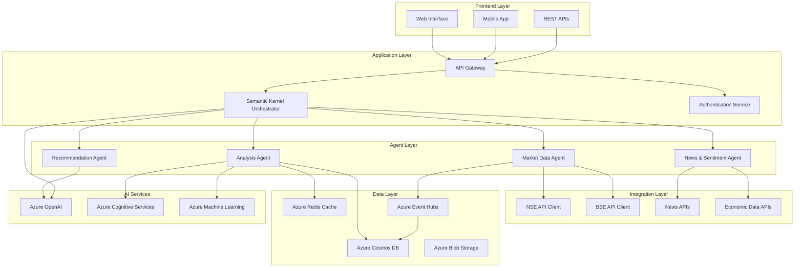

# Technical Architecture - Indian Stock Market AI Agent

## 🏛️ Architecture Overview

This document outlines the detailed technical architecture for the specialized AI agent targeting the Indian stock market (NSE & BSE) using Azure AI Foundry and Semantic Kernel.

---

## 🎯 Architecture Principles

### Design Principles
1. **Microservices Architecture**: Loosely coupled, independently deployable services
2. **Event-Driven Design**: Asynchronous processing for real-time market data
3. **Cloud-Native**: Leverage Azure PaaS services for scalability and reliability
4. **Security-First**: Zero-trust security model with comprehensive data protection
5. **Multi-Agent Pattern**: Specialized agents for different financial domains

### Non-Functional Requirements
- **Performance**: Sub-2 second response time for 95% of queries
- **Scalability**: Handle 10,000+ concurrent users
- **Availability**: 99.9% uptime with disaster recovery
- **Security**: Enterprise-grade security with compliance
- **Maintainability**: Clean code with comprehensive documentation

---

## 🏗️ System Architecture

### High-Level Architecture Diagram



---

## 🔧 Component Architecture

### 1. Semantic Kernel Orchestrator

**Purpose**: Central coordination hub for multi-agent interactions and conversation flow management.

```csharp
public class FinancialAgentOrchestrator
{
    private readonly IKernel _kernel;
    private readonly ILogger<FinancialAgentOrchestrator> _logger;
    private readonly IIntentClassifier _intentClassifier;
    private readonly Dictionary<string, IFinancialAgent> _agents;
    
    public async Task<AgentResponse> ProcessUserQuery(UserQuery query)
    {
        // 1. Intent Classification
        var intent = await _intentClassifier.ClassifyAsync(query.Message);
        
        // 2. Context Extraction
        var context = await ExtractContextAsync(query);
        
        // 3. Agent Selection and Routing
        var selectedAgent = SelectAgent(intent);
        
        // 4. Agent Execution
        var agentResponse = await selectedAgent.ProcessAsync(context);
        
        // 5. Response Synthesis
        return await SynthesizeResponseAsync(agentResponse, context);
    }
}
```

**Key Features**:
- Intent classification using Azure OpenAI
- Multi-agent coordination and workflow management
- Context preservation across conversations
- Response synthesis and formatting

### 2. Market Data Agent

**Purpose**: Real-time and historical market data acquisition and processing.

```csharp
public class MarketDataAgent : IFinancialAgent
{
    private readonly INseApiService _nseApi;
    private readonly IBseApiService _bseApi;
    private readonly IMarketDataRepository _repository;
    private readonly IEventHubProducer _eventProducer;
    
    public async Task<AgentResponse> ProcessAsync(AgentContext context)
    {
        switch (context.Intent)
        {
            case "GET_STOCK_PRICE":
                return await GetStockPrice(context.Symbol);
            case "GET_MARKET_TRENDS":
                return await GetMarketTrends(context.TimeFrame);
            case "GET_TRADING_VOLUME":
                return await GetTradingVolume(context.Symbol);
        }
    }
    
    private async Task<AgentResponse> GetStockPrice(string symbol)
    {
        // Fetch from both NSE and BSE for validation
        var nseData = await _nseApi.GetStockPriceAsync(symbol);
        var bseData = await _bseApi.GetStockPriceAsync(symbol);
        
        // Validate and reconcile data
        var validatedData = ValidateMarketData(nseData, bseData);
        
        // Store in database
        await _repository.SaveMarketDataAsync(validatedData);
        
        // Publish to event stream
        await _eventProducer.PublishAsync(validatedData);
        
        return new AgentResponse
        {
            Data = validatedData,
            Message = FormatStockPriceResponse(validatedData)
        };
    }
}
```

### 3. Analysis Agent

**Purpose**: Technical and fundamental analysis with ML-powered insights.

```csharp
public class AnalysisAgent : IFinancialAgent
{
    private readonly ITechnicalAnalysisService _technicalAnalysis;
    private readonly IFundamentalAnalysisService _fundamentalAnalysis;
    private readonly IPredictionService _predictionService;
    private readonly ICacheService _cache;
    
    public async Task<AgentResponse> ProcessAsync(AgentContext context)
    {
        return context.Intent switch
        {
            "TECHNICAL_ANALYSIS" => await PerformTechnicalAnalysis(context),
            "FUNDAMENTAL_ANALYSIS" => await PerformFundamentalAnalysis(context),
            "PRICE_PREDICTION" => await PredictPrice(context),
            "RISK_ASSESSMENT" => await AssessRisk(context),
            _ => throw new NotSupportedException($"Intent {context.Intent} not supported")
        };
    }
    
    private async Task<AgentResponse> PerformTechnicalAnalysis(AgentContext context)
    {
        // Check cache first
        var cacheKey = $"technical_analysis_{context.Symbol}_{context.TimeFrame}";
        var cachedResult = await _cache.GetAsync<TechnicalAnalysisResult>(cacheKey);
        
        if (cachedResult != null && !cachedResult.IsExpired)
        {
            return new AgentResponse { Data = cachedResult };
        }
        
        // Fetch historical data
        var historicalData = await GetHistoricalData(context.Symbol, context.TimeFrame);
        
        // Calculate technical indicators
        var indicators = await _technicalAnalysis.CalculateIndicators(historicalData);
        
        // Generate insights using AI
        var insights = await GenerateAnalysisInsights(indicators);
        
        var result = new TechnicalAnalysisResult
        {
            Symbol = context.Symbol,
            Indicators = indicators,
            Insights = insights,
            Timestamp = DateTime.UtcNow
        };
        
        // Cache the result
        await _cache.SetAsync(cacheKey, result, TimeSpan.FromMinutes(5));
        
        return new AgentResponse { Data = result };
    }
}
```

### 4. Recommendation Agent

**Purpose**: AI-powered investment recommendations and portfolio optimization.

```csharp
public class RecommendationAgent : IFinancialAgent
{
    private readonly IPortfolioOptimizer _portfolioOptimizer;
    private readonly IRiskProfiler _riskProfiler;
    private readonly IRecommendationEngine _recommendationEngine;
    private readonly IComplianceService _compliance;
    
    public async Task<AgentResponse> ProcessAsync(AgentContext context)
    {
        // Ensure compliance disclaimers
        await _compliance.ValidateRecommendationRequest(context);
        
        return context.Intent switch
        {
            "INVESTMENT_RECOMMENDATION" => await GenerateInvestmentRecommendation(context),
            "PORTFOLIO_OPTIMIZATION" => await OptimizePortfolio(context),
            "RISK_BASED_ALLOCATION" => await GenerateRiskBasedAllocation(context),
            _ => throw new NotSupportedException($"Intent {context.Intent} not supported")
        };
    }
    
    private async Task<AgentResponse> GenerateInvestmentRecommendation(AgentContext context)
    {
        // Assess user's risk profile
        var riskProfile = await _riskProfiler.AssessRiskProfile(context.UserId);
        
        // Get market analysis
        var marketAnalysis = await GetMarketAnalysis(context.Symbols);
        
        // Generate recommendations
        var recommendations = await _recommendationEngine.GenerateRecommendations(
            riskProfile, 
            marketAnalysis, 
            context.InvestmentAmount,
            context.InvestmentHorizon
        );
        
        // Add compliance disclaimers
        recommendations = await _compliance.AddDisclaimers(recommendations);
        
        return new AgentResponse
        {
            Data = recommendations,
            Message = FormatRecommendationResponse(recommendations),
            Disclaimers = GetRequiredDisclaimers()
        };
    }
}
```

---

## 🔌 Integration Architecture

### External API Integrations

#### NSE (National Stock Exchange) Integration
```csharp
public class NseApiService : INseApiService
{
    private readonly HttpClient _httpClient;
    private readonly IConfiguration _config;
    private readonly ILogger<NseApiService> _logger;
    
    public async Task<StockData> GetStockPriceAsync(string symbol)
    {
        var endpoint = $"{_config["NSE:BaseUrl"]}/api/equity-stockIndices?index=SECURITIES%20IN%20F%26O";
        
        using var response = await _httpClient.GetAsync(endpoint);
        response.EnsureSuccessStatusCode();
        
        var jsonData = await response.Content.ReadAsStringAsync();
        var nseResponse = JsonSerializer.Deserialize<NseResponse>(jsonData);
        
        return MapToStockData(nseResponse, symbol);
    }
}
```

#### BSE (Bombay Stock Exchange) Integration
```csharp
public class BseApiService : IBseApiService
{
    private readonly HttpClient _httpClient;
    private readonly IMemoryCache _cache;
    
    public async Task<StockData> GetStockPriceAsync(string symbol)
    {
        var cacheKey = $"bse_stock_{symbol}";
        
        if (_cache.TryGetValue(cacheKey, out StockData cachedData))
        {
            return cachedData;
        }
        
        var endpoint = $"https://api.bseindia.com/BseIndiaAPI/api/StockReachGraph/w";
        var requestData = new { scripcode = symbol, flag = "1D" };
        
        var response = await _httpClient.PostAsJsonAsync(endpoint, requestData);
        var stockData = await ProcessBseResponse(response);
        
        _cache.Set(cacheKey, stockData, TimeSpan.FromMinutes(1));
        return stockData;
    }
}
```

---

## 💾 Data Architecture

### Database Design

#### 1. Azure Cosmos DB - Market Data Storage
```json
{
  "id": "RELIANCE_20231205_093000",
  "symbol": "RELIANCE",
  "exchange": "NSE",
  "timestamp": "2023-12-05T09:30:00Z",
  "price": {
    "open": 2750.50,
    "high": 2755.30,
    "low": 2748.20,
    "close": 2752.80,
    "volume": 125000
  },
  "technicalIndicators": {
    "sma20": 2745.60,
    "rsi": 68.5,
    "macd": 2.3
  },
  "ttl": 2592000 // 30 days retention
}
```

#### 2. User Portfolio Storage
```json
{
  "id": "user_portfolio_12345",
  "userId": "12345",
  "portfolioName": "Growth Portfolio",
  "holdings": [
    {
      "symbol": "RELIANCE",
      "quantity": 50,
      "averagePrice": 2680.00,
      "currentValue": 137640.00
    }
  ],
  "riskProfile": "MODERATE",
  "lastUpdated": "2023-12-05T10:15:00Z"
}
```

### Caching Strategy

#### Redis Cache Implementation
```csharp
public class CacheService : ICacheService
{
    private readonly IDatabase _database;
    
    public async Task SetAsync<T>(string key, T value, TimeSpan expiry)
    {
        var serializedValue = JsonSerializer.Serialize(value);
        await _database.StringSetAsync(key, serializedValue, expiry);
    }
    
    public async Task<T> GetAsync<T>(string key)
    {
        var value = await _database.StringGetAsync(key);
        return value.HasValue ? JsonSerializer.Deserialize<T>(value) : default(T);
    }
}

// Cache Strategy
// - Stock prices: 30 seconds TTL
// - Technical analysis: 5 minutes TTL
// - News sentiment: 15 minutes TTL
// - User portfolios: 1 hour TTL
```

---

## 🔐 Security Architecture

### Authentication & Authorization

#### Azure AD B2C Integration
```csharp
public class AuthenticationService
{
    public async Task<AuthenticationResult> AuthenticateUser(string token)
    {
        var handler = new JwtSecurityTokenHandler();
        var validationParameters = new TokenValidationParameters
        {
            ValidateIssuer = true,
            ValidateAudience = true,
            ValidateLifetime = true,
            ValidateIssuerSigningKey = true,
            ValidIssuer = _configuration["AzureAdB2C:Issuer"],
            ValidAudience = _configuration["AzureAdB2C:Audience"],
            IssuerSigningKeyResolver = GetSigningKeys
        };
        
        var principal = handler.ValidateToken(token, validationParameters, out var validatedToken);
        return new AuthenticationResult { IsSuccess = true, User = principal };
    }
}
```

### Data Encryption

#### Encryption at Rest and in Transit
```yaml
Encryption Strategy:
  At Rest:
    - Cosmos DB: Azure Managed Keys + Customer Managed Keys
    - Blob Storage: AES-256 encryption
    - Key Vault: Hardware Security Module (HSM)
  
  In Transit:
    - TLS 1.3 for all API communications
    - mTLS for service-to-service communication
    - VPN Gateway for hybrid connections
```

---

## 📊 Monitoring & Observability

### Application Insights Integration

```csharp
public class TelemetryService
{
    private readonly TelemetryClient _telemetryClient;
    
    public void TrackUserQuery(string userId, string query, double responseTime)
    {
        _telemetryClient.TrackEvent("UserQuery", new Dictionary<string, string>
        {
            ["UserId"] = userId,
            ["Query"] = query,
            ["ResponseTime"] = responseTime.ToString()
        });
    }
    
    public void TrackMarketDataLatency(string exchange, double latency)
    {
        _telemetryClient.TrackMetric("MarketDataLatency", latency, new Dictionary<string, string>
        {
            ["Exchange"] = exchange
        });
    }
}
```

### Key Metrics Dashboard
```yaml
Performance Metrics:
  - Response time percentiles (P50, P95, P99)
  - Request rate and throughput
  - Error rates by component
  - API dependency latencies

Business Metrics:
  - Daily active users
  - Query volume by category
  - User satisfaction scores
  - Feature adoption rates

Infrastructure Metrics:
  - CPU and memory utilization
  - Database performance metrics
  - Cache hit ratios
  - Network bandwidth usage
```

---

## 🚀 Deployment Architecture

### Azure Container Apps Deployment

```yaml
# azure-container-app.yaml
apiVersion: apps/v1
kind: Deployment
metadata:
  name: financial-agent-orchestrator
spec:
  replicas: 3
  selector:
    matchLabels:
      app: financial-agent-orchestrator
  template:
    metadata:
      labels:
        app: financial-agent-orchestrator
    spec:
      containers:
      - name: orchestrator
        image: financialagent.azurecr.io/orchestrator:latest
        ports:
        - containerPort: 8080
        env:
        - name: ASPNETCORE_ENVIRONMENT
          value: "Production"
        - name: CosmosDB__ConnectionString
          valueFrom:
            secretKeyRef:
              name: cosmos-secret
              key: connectionString
        resources:
          requests:
            memory: "512Mi"
            cpu: "250m"
          limits:
            memory: "1Gi"
            cpu: "500m"
```

### CI/CD Pipeline

```yaml
# azure-pipelines.yml
trigger:
  branches:
    include:
    - main
    - develop

variables:
  buildConfiguration: 'Release'
  containerRegistry: 'financialagent.azurecr.io'

stages:
- stage: Build
  jobs:
  - job: BuildAndTest
    pool:
      vmImage: 'ubuntu-latest'
    steps:
    - task: DotNetCoreCLI@2
      displayName: 'Restore packages'
      inputs:
        command: 'restore'
        projects: '**/*.csproj'
    
    - task: DotNetCoreCLI@2
      displayName: 'Build solution'
      inputs:
        command: 'build'
        projects: '**/*.csproj'
        arguments: '--configuration $(buildConfiguration)'
    
    - task: DotNetCoreCLI@2
      displayName: 'Run tests'
      inputs:
        command: 'test'
        projects: '**/*Tests.csproj'
        arguments: '--configuration $(buildConfiguration) --collect:"XPlat Code Coverage"'

- stage: Deploy
  condition: and(succeeded(), eq(variables['Build.SourceBranch'], 'refs/heads/main'))
  jobs:
  - deployment: DeployToProduction
    environment: 'production'
    strategy:
      runOnce:
        deploy:
          steps:
          - task: AzureContainerApps@1
            displayName: 'Deploy to Azure Container Apps'
            inputs:
              azureSubscription: 'Azure-RM-Connection'
              resourceGroup: 'financial-agent-rg'
              containerAppName: 'financial-agent-orchestrator'
              containerImage: '$(containerRegistry)/orchestrator:$(Build.BuildId)'
```

---

## 🔧 Configuration Management

### Environment Configuration

```json
{
  "AzureOpenAI": {
    "Endpoint": "https://financial-agent-openai.openai.azure.com/",
    "DeploymentName": "gpt-4",
    "ApiVersion": "2024-02-15-preview",
    "MaxTokens": 4000
  },
  "CosmosDB": {
    "EndpointUri": "https://financial-agent-cosmos.documents.azure.com:443/",
    "DatabaseName": "FinancialData",
    "Containers": {
      "MarketData": "market-data",
      "UserPortfolios": "user-portfolios",
      "TradingHistory": "trading-history"
    }
  },
  "ExternalAPIs": {
    "NSE": {
      "BaseUrl": "https://www.nseindia.com",
      "RateLimit": "100/minute",
      "Timeout": "10s"
    },
    "BSE": {
      "BaseUrl": "https://api.bseindia.com",
      "RateLimit": "50/minute",
      "Timeout": "15s"
    }
  },
  "Cache": {
    "Redis": {
      "ConnectionString": "financial-agent-redis.redis.cache.windows.net:6380",
      "DefaultTTL": "00:05:00"
    }
  }
}
```

---

## 📈 Performance Optimization

### Caching Strategy
```csharp
public class MultiLevelCacheService
{
    private readonly IMemoryCache _l1Cache; // In-memory
    private readonly IDistributedCache _l2Cache; // Redis
    private readonly ICosmosRepository _l3Cache; // Cosmos DB
    
    public async Task<T> GetAsync<T>(string key)
    {
        // L1: Check in-memory cache
        if (_l1Cache.TryGetValue(key, out T value))
            return value;
        
        // L2: Check Redis cache
        value = await _l2Cache.GetAsync<T>(key);
        if (value != null)
        {
            _l1Cache.Set(key, value, TimeSpan.FromMinutes(5));
            return value;
        }
        
        // L3: Check database
        value = await _l3Cache.GetAsync<T>(key);
        if (value != null)
        {
            await _l2Cache.SetAsync(key, value, TimeSpan.FromHours(1));
            _l1Cache.Set(key, value, TimeSpan.FromMinutes(5));
        }
        
        return value;
    }
}
```

### Connection Pooling
```csharp
public class OptimizedHttpClientFactory
{
    public HttpClient CreateNseClient()
    {
        var handler = new SocketsHttpHandler
        {
            PooledConnectionLifetime = TimeSpan.FromMinutes(15),
            PooledConnectionIdleTimeout = TimeSpan.FromMinutes(5),
            MaxConnectionsPerServer = 20
        };
        
        return new HttpClient(handler)
        {
            Timeout = TimeSpan.FromSeconds(30)
        };
    }
}
```

---

## 🔍 Testing Strategy

### Unit Testing Framework
```csharp
[TestClass]
public class MarketDataAgentTests
{
    private Mock<INseApiService> _mockNseApi;
    private Mock<IMarketDataRepository> _mockRepository;
    private MarketDataAgent _agent;
    
    [TestInitialize]
    public void Setup()
    {
        _mockNseApi = new Mock<INseApiService>();
        _mockRepository = new Mock<IMarketDataRepository>();
        _agent = new MarketDataAgent(_mockNseApi.Object, _mockRepository.Object);
    }
    
    [TestMethod]
    public async Task GetStockPrice_ValidSymbol_ReturnsStockData()
    {
        // Arrange
        var expectedData = new StockData { Symbol = "RELIANCE", Price = 2750.50 };
        _mockNseApi.Setup(x => x.GetStockPriceAsync("RELIANCE"))
                  .ReturnsAsync(expectedData);
        
        // Act
        var result = await _agent.GetStockPrice("RELIANCE");
        
        // Assert
        Assert.IsNotNull(result);
        Assert.AreEqual("RELIANCE", result.Data.Symbol);
        Assert.AreEqual(2750.50, result.Data.Price);
    }
}
```

### Integration Testing
```csharp
[TestClass]
public class NseApiIntegrationTests
{
    private NseApiService _nseApi;
    
    [TestInitialize]
    public void Setup()
    {
        var httpClient = new HttpClient();
        var config = TestConfiguration.GetConfiguration();
        _nseApi = new NseApiService(httpClient, config);
    }
    
    [TestMethod]
    public async Task GetStockPrice_RealAPI_ReturnsValidData()
    {
        // Test with actual NSE API
        var result = await _nseApi.GetStockPriceAsync("RELIANCE");
        
        Assert.IsNotNull(result);
        Assert.AreEqual("RELIANCE", result.Symbol);
        Assert.IsTrue(result.Price > 0);
    }
}
```

This technical architecture provides a robust, scalable, and secure foundation for your Indian stock market AI agent. The architecture follows Azure best practices and is designed to handle the specific requirements of financial data processing and real-time market analysis.